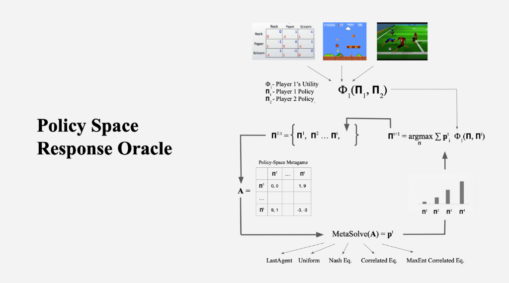
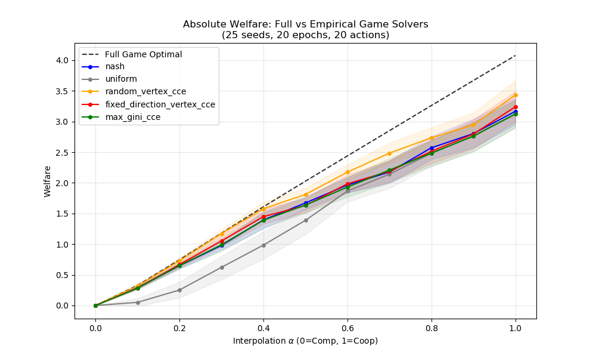
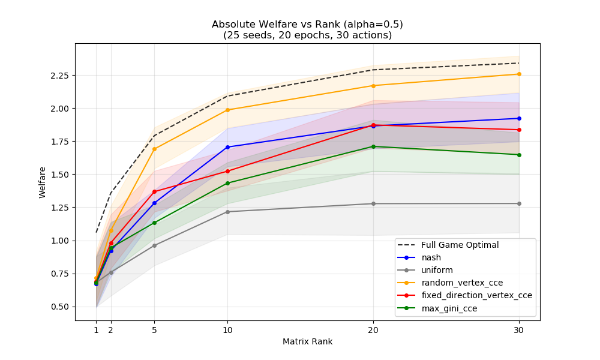
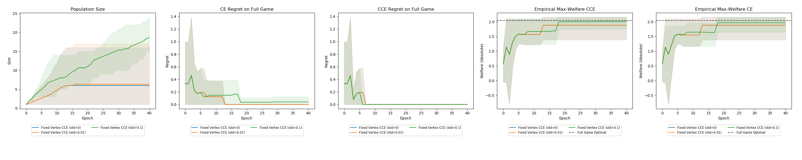

# (J)PSRO in General-Sum Games

This repository implements Policy Space Response Oracles (PSRO) and related equilibrium solvers for game theoretic analysis, focusing on Coarse Correlated Equilibria (CCE) and Correlated Equilibria (CE) in general-sum games.

## Experimental Results

### Competitive vs Collaborative Environments
Sweep of JPSRO methods between competitive (alpha=0) and collaborative (alpha=1) environments.
- **Result:** `random_vertex_cce` dominates as a meta-strategy.
- **Run:** `python run_alpha_sweep_absolute.py`

### Rank Sweep (Strategic Complexity)
Sweep of JPSRO methods with games of varying rank (strategic complexity).
- **Result:** `max_gini` underperforms in this setup.
- **Run:** `python run_rank_sweep_absolute.py`

### Stochastic Payoffs
Comparison of JPSRO on a NF game with added Gaussian noise (std dev: 0, 0.01, 0.1).
- **Result:** Noise can boost exploration, similar to stochastic gradients.
- **Run:** `python run_stochastic_experiment.py`

## Files Description

### Core Logic
- **`psro.py`**: The main entry point for running PSRO experiments on matrix games. Supports various meta-solvers (Nash, CCE, CE, Random) and tracks welfare/regret over epochs.
- **`solvers.py`**: Implements equilibrium solvers using `cvxpy`, including:
  - `solve_max_welfare_cce`: Max Welfare Coarse Correlated Equilibrium.
  - `solve_max_welfare_ce`: Max Welfare Correlated Equilibrium.
  - `solve_cce_joint`: CCE with various objectives (Entropy, Gini, etc.).
  - `fictitious_play_symmetric`: Standard fictitious play.
- **`games.py`**: Libraries for generating synthetic games, including:
  - Competitive-Cooperative interpolation ("Alpha" games).
  - Candogan-style Potential/Harmonic games.
  - Symmetric and Zero-sum mixtures.
- **`metrics.py`**: Utilities for calculating equilibrium metrics:
  - `calculate_cce_regret`: CCE Regret.
  - `calculate_ce_regret`: CE Regret.
- **`oracles.py`**: Best Response logic for PSRO:
  - `compute_best_responses`: Standard BR against mixed strategies.
  - `compute_rectified_best_responses`: Rectified BR for JPSRO/CCE expansion.

### Experiments & Analysis
- **`debug.py`**: A script performing a parameter sweep on the game correlation "alpha," plotting the relationship between alpha and Max Welfare CCE/CE.
- **`profile_solver_speed.py`**: logical benchmarking script to compare execution times of different solvers.
- **`psro_os.py`**: An OpenSpiel-compatible implementation of the PSRO loop, featuring `TabularPolicy` and `BestResponseOracle` wrappers.

### Testing
- **`test_solvers.py`**: Unit tests validating solver correctness against analytical games (PD, Battle of Sexes, Chicken) and verifying theoretical properties (e.g., Welfare(CCE) $\ge$ Welfare(CE)).
- **`test_psro.py`**: Tests for the PSRO experiment loop.
